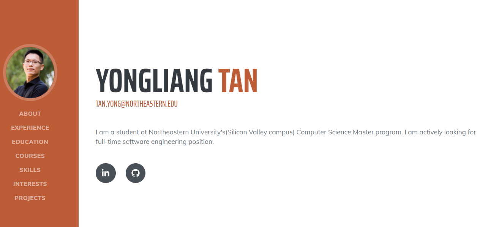
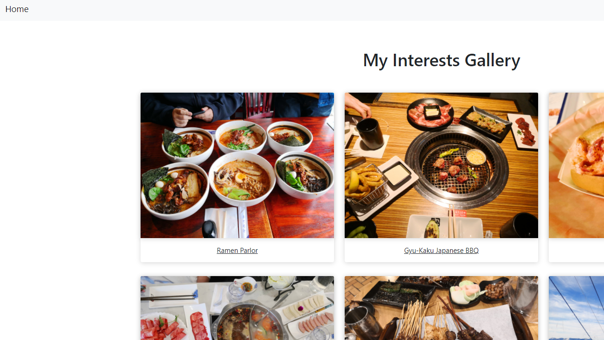

  

<h1 align="center">Yongliang (Sean) Tan's Home Page</h1>

## Project objective

This project is served as project homework 1 of Northeastern University's Spring 2021's CS-5610 class. You could find the class link in below class link section.

As the first project in the class, the goal is to create a simple, more than 2-page website using HTML, CSS and some JavaScript. I believe this is a great chance for me to demonstrate what I have learned in the class so far.

I have designed a simple website with two pages. The first page is a resume style home page using a free template. The second page is a gallery designed by others, but I use JavaScript code to generate the HTML elements instead. I have shared 5 of my favorite restaurants and some photos from one of my Lake Tahoe ski trips.

## Screenshots

## Tech requirements

Modern Browser(Chrome, FireFox, etc.), command line tool

## How to install/use
1. Clone this repo to your own computer.
2. Use command line tool, cd to the repo's path.
3. Use a local http server tool like Reload or Python to run http-server, the website is now locally run.

## Page link

https://seantanty.github.io/CS-5610-project1/index.html

## CS-5610 class link

https://johnguerra.co/classes/webDevelopment_spring_2021/

## Template used

1. https://startbootstrap.com/theme/resume

2. https://tutorialzine.com/2018/03/3-amazing-bootstrap-4-gallery-templates

## Slides: 

https://docs.google.com/presentation/d/15TQaOsgwKcBNrYzhxT6H1ipWbUFTjQ2aTgAhiriORNE/edit?usp=sharing

## Video demonstrating: 
